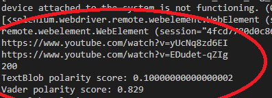

# ScreenScraper

Automated a system to query for videos on YouTube and use the video ID to aggregate
comments.

Utilized TextBlob and VaderSentiment to effectively determine the polarity metrics of the
comments.

Image depicts a sampling of 200 comments from 2 videos, and the average polarity scores for these comments according
to two different sentiment analysis libraries.

